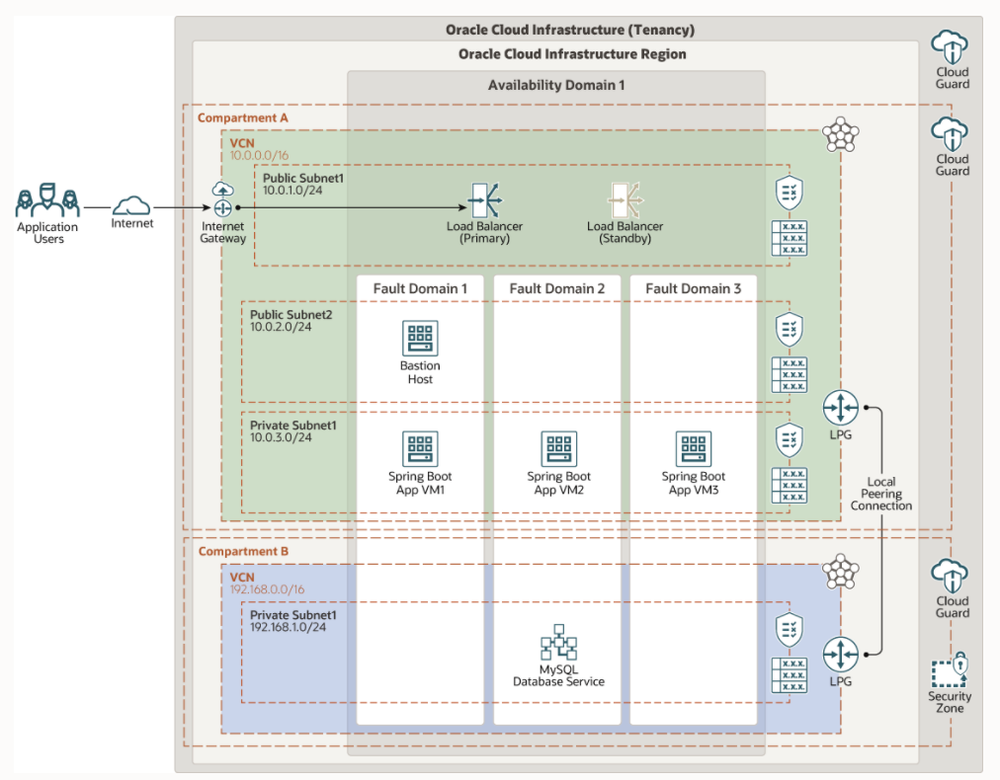

# oci-arch-app-mds

MySQL Database service is a managed Database service on Oracle Cloud Infrastructure. In this deployment we will deploy 3 node cluster(app server) along with a Load Balancer and MySQL Database service.
##  These app server can then be installed with an application such as mypetclinic (https://projects.spring.io/spring-petclinic/), and configured to work with MySQL.
## For more information please refer to https://github.com/spring-projects/spring-petclinic

## Terraform Provider for Oracle Cloud Infrastructure
The OCI Terraform Provider is now available for automatic download through the Terraform Provider Registry. 
For more information on how to get started view the [documentation](https://www.terraform.io/docs/providers/oci/index.html) 
and [setup guide](https://www.terraform.io/docs/providers/oci/guides/version-3-upgrade.html).

* [Documentation](https://www.terraform.io/docs/providers/oci/index.html)
* [OCI forums](https://cloudcustomerconnect.oracle.com/resources/9c8fa8f96f/summary)
* [Github issues](https://github.com/terraform-providers/terraform-provider-oci/issues)
* [Troubleshooting](https://www.terraform.io/docs/providers/oci/guides/guides/troubleshooting.html)

## Clone the repo
Now, you'll want a local copy of this repo. You can make that with the commands:

    git clone https://github.com/oracle-quickstart/oci-arch-app-mds
    cd oci-arch-app-mds
    ls

## Prerequisites
First off, you'll need to do some pre-deploy setup.  That's all detailed [here](https://github.com/cloud-partners/oci-prerequisites).

Initialize them in  `terraform.tfvars` file and populate with the following information:

```
# Authentication
tenancy_ocid         = <"">
user_ocid            = <"">
fingerprint          = <"">
private_key_path     = <"">
# SSH Keys
ssh_public_key  = "id_rsa.pub"
ssh_private_key = "id_rsa"

# Region
region = "us-ashburn-1"

# Compartment
compartment_ocid = <"">    (Compartment without Security Zones enabled)
compartment_SZ_ocid = <""> (Compartment with Security Zones enabled)

````

NOTE: There are other variables that are assigned default value such as VCN CIDR and others. These can be changed in variables.tf file

Deploy:

    terraform init
    terraform plan
    terraform apply


## Install Springboot
To install Springboot follow the steps here;
https://docs.spring.io/spring-boot/docs/current/reference/html/getting-started.html
Github Repo can also be accessed at ;
https://github.com/spring-projects/spring-framework

## Destroy the Deployment 
When you no longer need the deployment, you can run this command to destroy it:

    terraform destroy

## Deploy the Spring Boot framework on Oracle Cloud Infrastructure with MySQL Database Service



## Reference Architecture

- [Deploy the Spring Boot framework on Oracle Cloud Infrastructure with MySQL Database Service] (https://docs.oracle.com/en/solutions/springboot-mysql-oci/)
